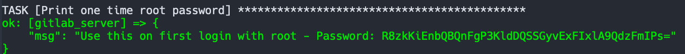

#  Gitlab + Jenkins on Virtual Machine 

**WARNING: This 2 vms takes 5GB of memory, make sure you can handle it before run the vagrant up**

## Development

- Clone repository
- Ensure to have Vagrant and VirtualBox
- Create a python virtual environment
- Run `pip install -r requirements.txt`
- Run `vagrant up`

The last command create the virtual machine and provision it with Gitlab and Jenkins using ansible. Once `vagrant up` is done you could find Gitlab on [192.168.59.103](http://192.168.59.103) and Jenkins on [192.168.59.104](http://192.168.59.104).

The password of the Gitlab root user will be printed on output using ansible debug message and you will find on the output of the vagrant provision:

In the same way you could find the Jenkins secret.

## Screenshots

